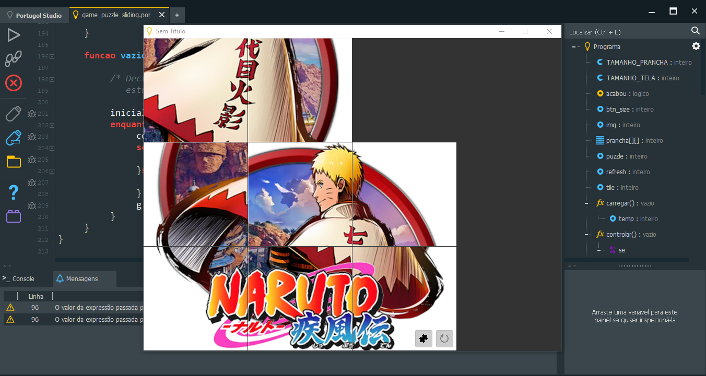
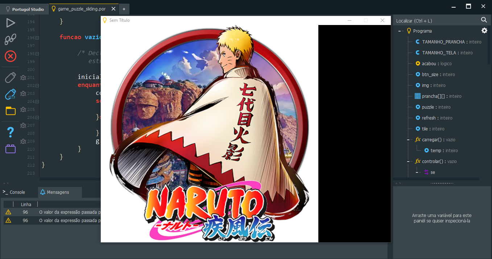

# puzzle-naruto

## Sliding Puzzle do Anime Naruto Shippuden

<h2>:bookmark_tabs: Descrição</h2>

_**Sliding Puzzle**_ é um quebra-cabeça de combinação deslizante que desafia o jogador a deslizar peças ao longo de certas rotas para estabelecer uma determinada configuração final. Você pode criar novos a partir de suas próprias fotos ou você pode fazer um quebra-cabeças interativos a partir de uma foto do seu animal de estimação, série ou filme favorito e enviá-lo aos seus amigos.

# Screenshot do Game _**Sliding Puzzle**_

  

  

## IMPORTANTE:

  

Você tem todo o direito de usar esse material para seu próprio aprendizado. Espero que seja útil o conteúdo disponibilizado. Para rodar o jogo no seu computador ou em outro dispositivo é preciso ter instalado o Programa Portugol Studio. 
